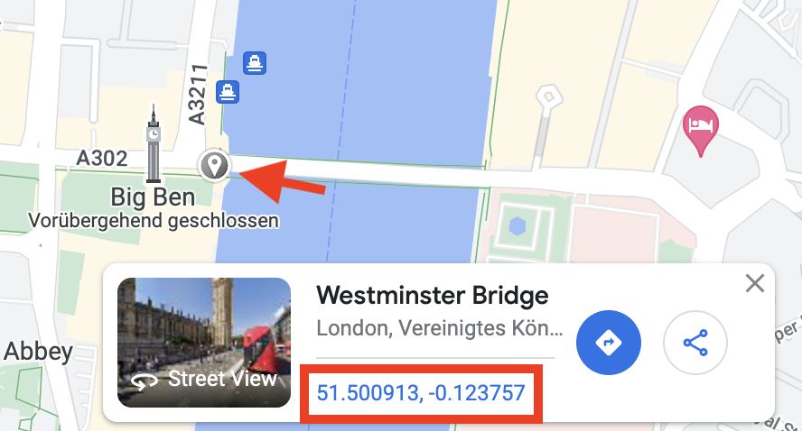

# GPS Audio Player Sample Data

This repository contains two sample routes to demonstrate the features of the GPS Audio app to new users.

* `DE --> German`
* `EN --> English`

Besides this `README` provides a comprehensive tutorial for new users to set up their own routes in GPS Audio Player.

# Tutorial

Welcome to the GPS Audio Player setup tutorial.
If you face any problems regarding the creation and editing of routes or the usage of the app, do not hesitate and contact us at: info@gpsaudio.app

## Prerequisites

* PC or Mac
* Web browser
* Editor for JSON documents (not strictly necessary but **very, very handy**)
  * Either a locally installed app like *VisualStudio Code, Notepad++, Sublime etc.* (recommended)
  * Or an online JSON editor such as *jsoneditoronline.org*
* Audio tracks for your guided tour
* iOS device with GPS Audio Player

## Download the template files

To start off the route creation, let's first [download the sample data here](https://github.com/mxmtht/gpsa_sample_content/archive/refs/heads/master.zip).

## Getting to know the directory stucture

After unpacking the downloading the sample file you will find a directory called `gpsa_sample_content` in your downloads folder.
You may want to move this directory to a different place, where you can find it easily and also rename it to your purpose e. g. `My Audio Automation`.

Following this, let's take a look at the folder, which we will call **content-root** from now on.
There are several objects in the **content-root** directory:

1. The subdirectories `DE_sample` and `EN_sample` containing MP3 files. We recommend creating a subdirectory for every route.
1. The documents `DE_sample_route`, `EN_sample_route` with the file suffix `.json`. These documents link the audio tracks from the directories above with geographic coordinates for automatic playback. Every route needs its own JSON-Document.
1. A document `campaign` with the file suffix `.json`. This documents lists all of the announcements that can be played manually.
1. A `README` file containing this tutorial in English.

## Route creation

Let's build a new route in 3 steps:

1. Put your audio files in place
1. Create and customize a JSON-document for your route

### Audio files

**GPS Audio Player** can only access files that are in the **content-root** directory, which is why you will need to copy the audio tracks to this directory.
Start by creating a subdirectory for every route that you want to automate.
> 💡 Of course you could just drop all audio tracks in the content-root directory but it is recommended to have a subdirectory for every route.

> 💡 It is recommended to also number the audio tracks, to make them always appear in the correct order.

### Route documents

Now that we have all our audio tracks in place we can create the JSON files for the tours.

#### Creating the documents

Recreating the data structure would be very cumbersome which is why we duplicate the existing file `EN_sample_route.json` and rename it according to our needs (like `EN_new_route.json`).

Before we start adding coordinates, let's first enter the correct details for our new tour.

```json
{
    "name": "My Automated English Tour",
    "fenceRadiusMeters": 75,
    "code": "GB",
    "_comment": "code is optional (country code ISO 3166-1)",
    "positions": [
        {
            "name": "Point 1",
            "coordinates": [40.690030, -74.045391],
            "file": "subdirectory/01_point1.mp3"
        },
        {
            "name": "Point 2",
            "coordinates": [41.690030, -75.045391],
            "file": "subdirectory/02_point2.mp3"
        }
    ]
}
```

> 💡 The appropriate **fenceRadiusMeters** depends on your way of transport and route. For *cars, coaches, ships and boats* a fence radius of 50 to 80 (meters) has proven useful. *Biking and pedestrian* routes require smaller radiuses between 10 and 25 (meters).

> 💡 See [Wikipedia](https://en.wikipedia.org/wiki/ISO_3166-1#Current_codes) for a list of all available country codes.

#### Adding route points

To define the points on your route you need to define positions in the array with the same name.
Every position has three mandatory fields, being:

* `name`: A human readable label of the point
* `coordinates`: The exact location of the route point
* `file`: The path to the audio file relative to the **content-root**

It is also possible to define a custom radiusses for single route points, but use this feature carefully.

> 💡 The easiest way to find the correct coordinates is to drop a pin at the desired location in Google Maps an copy the lat and lon values (see image below). 

## Announcements

Let's further setup some announcements in the `campaign.json` document. Announcements are not related to a geographic coordinate and can be played manually on demand.
**Do not change the file name nor the attribute** `name` **in this file.**

```json
{
    "name": "campaign",
    "_comment": "Recordings are shown on campaign button. You must use the filename campaign.json. (and above name!)",
    "recordings": [
        {
            "name": "Warning",
            "file": "subdirectory/warning.mp3"
        },
        {
            "name": "Holiday special",
            "file": "subdirectory/holidayspecial.mp3"
        }
    ]
}
```

Every announcement has two mandatory fields:

* `name`: A human readable label of the point
* `file`: The path to the audio file relative to the **content-root**

## Copying the files to your device

In order to deploy your tour to the iOS device we recommend always replacing all contents of the GPS Audio Player data on the iOS device.
After deleting all of the data in the GPS Audio Player folder simply drag and drop the contents of your content root into the GPS Audio Player folder on the iOS device and wait for the copying process to finish.

> 💡 When you open the app and your route is not displayed in the routes list, that is probably caused by a malformed JSON, with either invalid syntax (e. g. a missing comma) or missing fields. If audio files are missing, you will be prompted an error message after selecting the route in the route list.
